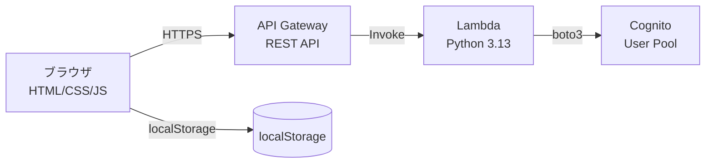
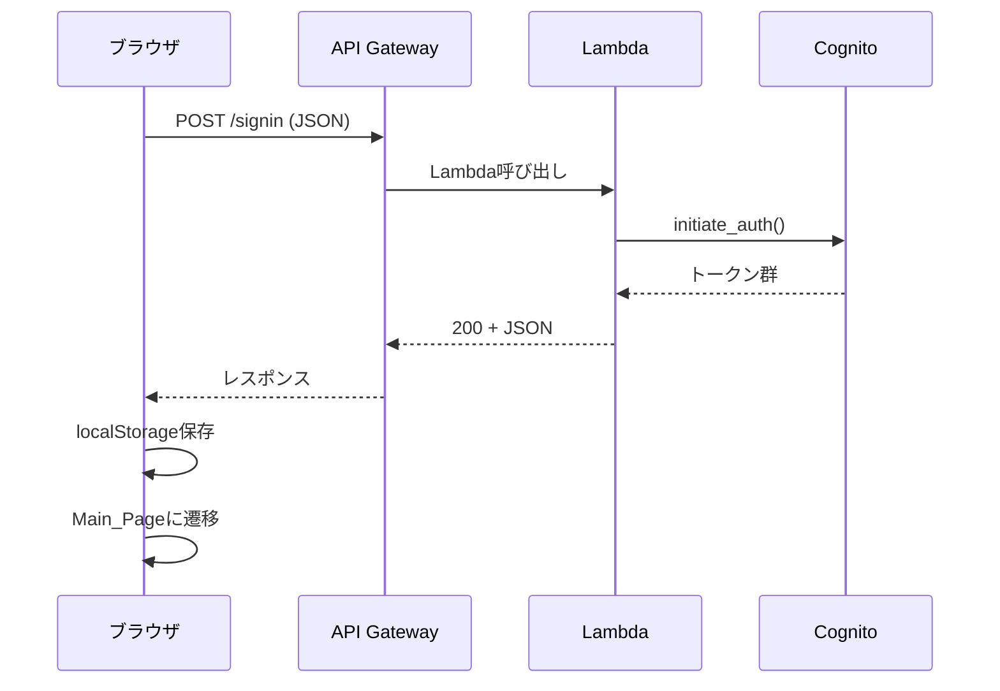
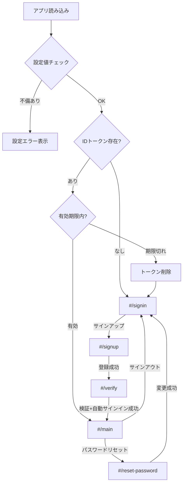

# 技術設計ドキュメント: Cognito認証SPA

## 概要

本設計は、Amazon Cognito User Poolを使用した認証機能付きシングルページアプリケーション（SPA）のアーキテクチャと実装方針を定義する。

### 設計方針

- フロントエンドはフレームワーク不使用のVanilla HTML/CSS/JavaScriptで構成
- バックエンドはAPI Gateway REST API + Lambda（Python 3.13）で構成
- Cognitoのマネージドログイン/Amplify UIは不使用、すべてのUIを自前実装
- SPAルーティングはハッシュベース（`#`）で実現し、サーバー設定不要とする
- リージョンは ap-northeast-1（東京）

### 主要な技術的判断

| 判断事項 | 選択 | 理由 |
|---------|------|------|
| SPAルーティング方式 | ハッシュベース（`location.hash`） | サーバー設定不要、S3静的ホスティングで追加設定なし |
| トークン保存先 | localStorage | 要件で指定済み。リフレッシュトークンフローは実装しない |
| Cognito認証フロー | USER_PASSWORD_AUTH（ユーザー名ベース） | App Clientのシークレットなしで利用可能、SPA向き。ユーザー名とパスワードで認証し、Eメールは必須属性として設定 |
| エラーメッセージ | 日本語固定 | Lambda側でCognitoエラーコードを日本語メッセージに変換 |
| CORS | API Gateway側で設定 | Lambda統合レスポンスにもCORSヘッダー付与 |

---

## アーキテクチャ

### システム全体構成



### リクエストフロー



### デプロイ構成

- **フロントエンド**: 静的ファイル（S3 + CloudFront、またはローカルファイル）
- **バックエンド**: API Gateway REST API + Lambda関数（単一関数、パスベースルーティング）
- **認証基盤**: Cognito User Pool + App Client（事前作成済み）
- **リージョン**: ap-northeast-1

---

## コンポーネントとインターフェース

### フロントエンド構成

```
frontend/
├── index.html          # SPAエントリポイント
├── css/
│   └── style.css       # スタイルシート
├── js/
│   ├── config.js       # 設定ファイル（Cognito/API設定値）
│   ├── app.js          # SPAルーター・アプリ初期化
│   ├── auth.js         # 認証関連ロジック（API呼び出し、トークン管理）
│   ├── pages.js        # ページ描画関数群
│   └── utils.js        # バリデーション・ユーティリティ
└── (favicon等の静的アセット)
```

#### コンポーネント責務

| ファイル | 責務 |
|---------|------|
| `config.js` | Cognito User Pool ID、App Client ID、APIエンドポイントURLの設定値を保持 |
| `app.js` | SPAルーター（hashchange監視）、初期化処理、認証状態判定、ページ振り分け |
| `auth.js` | APIリクエスト送信、トークンのlocalStorage保存/取得/削除、認証状態チェック |
| `pages.js` | 各ページのHTML生成・DOM操作・イベントリスナー登録 |
| `utils.js` | ユーザー名バリデーション、メールバリデーション、パスワードバリデーション、確認コードバリデーション、エラー表示 |

### バックエンド構成

```
backend/
├── lambda_function.py  # Lambda関数エントリポイント（単一ファイル）
└── (デプロイパッケージ)
```

#### Lambda関数の内部構造

```python
# lambda_function.py の論理構成
# - lambda_handler(): エントリポイント、パスベースルーティング
# - handle_signin(): サインイン処理
# - handle_signup(): サインアップ処理
# - handle_verify(): 確認コード検証処理
# - handle_change_password(): パスワード変更処理
# - handle_resend_code(): 確認コード再送処理
# - build_response(): レスポンスビルダー（CORSヘッダー付与）
# - translate_error(): Cognitoエラーコードを日本語メッセージに変換
```

### フロントエンド ↔ バックエンド インターフェース

フロントエンドはすべてのAPI呼び出しを `auth.js` の関数経由で行い、バックエンドのLambda関数と通信する。

---

## データモデル

### トークン構造（localStorage保存）

| キー | 値 | 説明 |
|-----|---|------|
| `cognito_id_token` | JWT文字列 | IDトークン。ユーザー属性（username, email等）を含む |
| `cognito_access_token` | JWT文字列 | アクセストークン。パスワード変更に使用 |
| `cognito_refresh_token` | 文字列 | リフレッシュトークン（本実装では自動更新は行わない） |

### IDトークン ペイロード構造（デコード後）

```json
{
  "sub": "xxxxxxxx-xxxx-xxxx-xxxx-xxxxxxxxxxxx",
  "email_verified": true,
  "iss": "https://cognito-idp.ap-northeast-1.amazonaws.com/ap-northeast-1_XXXXXXX",
  "cognito:username": "myuser",
  "aud": "app_client_id",
  "event_id": "...",
  "token_use": "id",
  "auth_time": 1700000000,
  "exp": 1700003600,
  "iat": 1700000000,
  "email": "user@example.com"
}
```

- `cognito:username`: ユーザーが設定したユーザー名
- `email`: 必須属性として設定されたメールアドレス

### APIリクエスト/レスポンス形式

#### POST /signin

**リクエスト:**
```json
{
  "username": "myuser",
  "password": "Password123!"
}
```

**成功レスポンス（200）:**
```json
{
  "success": true,
  "tokens": {
    "id_token": "eyJ...",
    "access_token": "eyJ...",
    "refresh_token": "xxx..."
  }
}
```

**失敗レスポンス（401）:**
```json
{
  "success": false,
  "error": "ユーザー名またはパスワードが正しくありません"
}
```

#### POST /signup

**リクエスト:**
```json
{
  "username": "myuser",
  "email": "user@example.com",
  "password": "Password123!"
}
```

**成功レスポンス（200）:**
```json
{
  "success": true,
  "message": "確認コードをメールに送信しました"
}
```

**失敗レスポンス（400）:**
```json
{
  "success": false,
  "error": "このユーザー名は既に登録されています"
}
```

#### POST /verify

**リクエスト:**
```json
{
  "username": "myuser",
  "code": "123456"
}
```

**成功レスポンス（200）:**
```json
{
  "success": true,
  "message": "アカウントが有効化されました"
}
```

**失敗レスポンス（400）:**
```json
{
  "success": false,
  "error": "確認コードが正しくありません"
}
```

#### POST /change-password

**リクエスト:**
```json
{
  "previous_password": "OldPassword123!",
  "new_password": "NewPassword456!"
}
```

**ヘッダー:**
```
Authorization: Bearer <access_token>
```

**成功レスポンス（200）:**
```json
{
  "success": true,
  "message": "パスワードが変更されました"
}
```

**失敗レスポンス（400）:**
```json
{
  "success": false,
  "error": "パスワードポリシーを満たしていません"
}
```

#### POST /resend-code

**リクエスト:**
```json
{
  "username": "myuser"
}
```

**成功レスポンス（200）:**
```json
{
  "success": true,
  "message": "確認コードを再送しました"
}
```

### Cognitoエラーコードと日本語メッセージのマッピング

| Cognitoエラーコード | HTTPステータス | 日本語メッセージ |
|-------------------|--------------|----------------|
| `NotAuthorizedException` | 401 | ユーザー名またはパスワードが正しくありません |
| `UserNotFoundException` | 401 | ユーザー名またはパスワードが正しくありません |
| `UsernameExistsException` | 400 | このユーザー名は既に登録されています |
| `InvalidPasswordException` | 400 | パスワードポリシーを満たしていません（8文字以上、英大文字・英小文字・数字・記号を含む） |
| `CodeMismatchException` | 400 | 確認コードが正しくありません |
| `ExpiredCodeException` | 400 | 確認コードの有効期限が切れています。再送してください |
| `LimitExceededException` | 400 | リクエスト回数の上限に達しました。しばらく待ってから再度お試しください |
| `InvalidParameterException` | 400 | 入力内容に不備があります |
| `UserNotConfirmedException` | 400 | アカウントが未確認です。確認コードを入力してください |
| その他 | 500 | システムエラーが発生しました。しばらく待ってから再度お試しください |

---

## フロントエンドページ構成とSPAルーティング

### ページ一覧

| ハッシュ | ページ | 認証要否 | 説明 |
|---------|-------|---------|------|
| `#/signin` | Sign_In_Page | 不要 | サインインフォーム（ユーザー名 + パスワード） |
| `#/signup` | Sign_Up_Page | 不要 | サインアップフォーム（ユーザー名 + メールアドレス + パスワード + パスワード確認） |
| `#/verify` | Verification_Page | 不要 | 確認コード入力 |
| `#/main` | Main_Page | 必要 | ユーザー名表示（IDトークンの`cognito:username`から取得） |
| `#/reset-password` | Password_Reset_Page | 必要 | パスワード変更 |

### ルーティングロジック



### ルーティングガード

- 認証必要ページ（`#/main`, `#/reset-password`）へのアクセス時、有効なトークンがなければ `#/signin` にリダイレクト
- 認証不要ページ（`#/signin`, `#/signup`）へのアクセス時、有効なトークンがあれば `#/main` にリダイレクト
- `hashchange`イベントでルーティング判定を実行

### トークン有効期限の判定

IDトークンのJWTペイロードに含まれる `exp` フィールド（UNIX秒）と現在時刻を比較する。JWTのデコードはBase64URLデコードのみで行い、署名検証はバックエンド側の責務とする。

---

## セキュリティ設計

### トークン管理

- **保存場所**: localStorage（要件指定）
- **保存キー**: `cognito_id_token`, `cognito_access_token`, `cognito_refresh_token`
- **有効期限チェック**: IDトークンの `exp` クレームをフロントエンドで確認（簡易チェック）
- **署名検証**: フロントエンドでは行わない。バックエンドがCognito経由で検証

### CORS設定

API Gatewayで以下のCORS設定を適用:

| 項目 | 値 |
|-----|---|
| Access-Control-Allow-Origin | フロントエンドのオリジン（開発時は `*`） |
| Access-Control-Allow-Methods | GET, POST, OPTIONS |
| Access-Control-Allow-Headers | Content-Type, Authorization |

Lambda関数のレスポンスにも同一のCORSヘッダーを付与する（Lambda統合のため）。

### 認証フロー（Cognito USER_PASSWORD_AUTH）

- App Clientはクライアントシークレットなしで作成
- `USER_PASSWORD_AUTH` フローを使用（SPA向け、サーバーサイドシークレット不要）
- ユーザー名とパスワードでサインイン。Eメールは必須属性としてサインアップ時に登録
- パスワードはフロントエンドからバックエンドにHTTPS経由で送信し、Lambda関数がCognitoに認証リクエストを送信

### セキュリティ考慮事項

- localStorage のトークンはXSS攻撃に対して脆弱だが、本サンプルではシンプルさを優先
- パスワードはフロントエンドで保持せず、認証完了後に破棄
- パスワード変更時はアクセストークンを使用し、Authorizationヘッダーで送信

---

## 正確性プロパティ

*プロパティとは、システムのすべての有効な実行において真であるべき特性や振る舞いのことです。仕様と機械的に検証可能な正確性保証をつなぐ橋渡しの役割を果たします。*

### プロパティ 1: 認証状態に基づくルーティング判定

*任意の*トークン状態（存在しない、期限切れ、有効）に対して、ルーティング関数は以下を満たす：有効なトークンが存在する場合は認証済みページへのアクセスを許可し、そうでない場合はサインインページへリダイレクトする。

**検証対象: 要件 1.1, 1.2, 1.5, 9.3, 9.4**

### プロパティ 2: トークン保存のラウンドトリップ

*任意の*有効なトークンセット（IDトークン、アクセストークン、リフレッシュトークン）に対して、localStorageに保存した後に取得した値は元の値と一致する。

**検証対象: 要件 2.4, 9.1**

### プロパティ 3: Cognitoエラーコードから日本語メッセージへの変換

*任意の*Cognitoエラーコードに対して、エラー変換関数は空でない日本語メッセージ文字列を返し、既知のエラーコードには対応する固定メッセージを、未知のエラーコードにはデフォルトメッセージを返す。

**検証対象: 要件 2.5, 3.6, 4.5, 7.7**

### プロパティ 4: フォーム入力バリデーション（空入力拒否）

*任意の*空文字列またはホワイトスペースのみの文字列に対して、必須フィールド（ユーザー名、メールアドレス、パスワード）のバリデーション関数はfalseを返し、APIリクエストは送信されない。

**検証対象: 要件 2.2, 7.3**

### プロパティ 5: パスワード一致バリデーション

*任意の*2つの異なる文字列ペアに対して、パスワード確認バリデーション関数はfalseを返す。また、*任意の*同一文字列ペアに対してはtrueを返す。

**検証対象: 要件 3.2, 7.4**

### プロパティ 6: メールアドレス形式バリデーション

*任意の*`@`を含まない文字列、またはローカル部・ドメイン部が空の文字列に対して、メールバリデーション関数はfalseを返す。*任意の*正しい形式のメールアドレスに対してはtrueを返す。

**検証対象: 要件 3.3**

### プロパティ 7: 確認コード形式バリデーション

*任意の*文字列に対して、確認コードバリデーション関数は「6桁の数字」にのみtrueを返し、それ以外の形式（空文字、文字含み、桁数不正）にはfalseを返す。

**検証対象: 要件 4.2**

### プロパティ 8: IDトークンからのユーザー名抽出

*任意の*有効なJWT形式のIDトークンに対して、デコード関数はペイロードの`cognito:username`フィールドの値を正しく返す。

**検証対象: 要件 5.1**

### プロパティ 9: サインアウト時の全トークン削除

*任意の*トークンセットがlocalStorageに保存されている状態で、サインアウト関数を実行した後、すべてのトークンキー（`cognito_id_token`, `cognito_access_token`, `cognito_refresh_token`）がlocalStorageに存在しない。

**検証対象: 要件 6.2**

### プロパティ 10: Lambda関数のレスポンス形式正当性

*任意の*有効なリクエストに対して、Lambda関数は HTTP 200とJSON形式のレスポンスを返す。*任意の*不正なJSONリクエストに対して、Lambda関数はHTTP 400とJSON形式のエラーメッセージを返す。*任意の*Cognitoエラーに対して、Lambda関数はエラー種別に応じた適切なHTTPステータスコード（401/400/500）とJSON形式のエラーメッセージを返す。

**検証対象: 要件 8.5, 8.6, 8.7**

### プロパティ 11: 設定ファイルのバリデーション

*任意の*設定オブジェクトに対して、いずれかの必須フィールド（User Pool ID、App Client ID、APIエンドポイント）が空文字または未定義の場合、設定バリデーション関数はfalseを返す。すべてが非空の場合はtrueを返す。

**検証対象: 要件 10.2, 10.3**

### プロパティ 12: AuthorizationヘッダーへのIDトークン付与

*任意の*トークン文字列に対して、APIリクエスト構築関数はAuthorizationヘッダーに`Bearer {token}`形式で値を設定する。

**検証対象: 要件 9.5**

---

## エラーハンドリング

### フロントエンドのエラーハンドリング方針

| レイヤー | エラー種別 | 対応 |
|---------|-----------|------|
| バリデーション | 入力不備 | フォーム上にエラーメッセージ表示、APIリクエスト送信しない |
| API通信 | ネットワークエラー | 「通信エラーが発生しました。ネットワーク接続を確認してください」表示 |
| API通信 | 401レスポンス | トークン削除 → サインインページ遷移 |
| API通信 | 400レスポンス | レスポンスのerrorフィールドを画面表示 |
| API通信 | 500レスポンス | 「システムエラーが発生しました」表示 |
| トークン | 期限切れ | トークン削除 → サインインページ遷移 |
| 設定 | 設定不備 | 設定エラーメッセージ表示、認証操作無効化 |

### バックエンド（Lambda）のエラーハンドリング方針

```python
# エラーハンドリングの擬似コード
def lambda_handler(event, context):
    try:
        # リクエストボディのJSONパース
        body = json.loads(event.get('body', ''))
    except (json.JSONDecodeError, TypeError):
        return build_response(400, {"success": False, "error": "リクエスト形式が不正です"})

    try:
        # Cognito API呼び出し
        result = cognito_client.initiate_auth(...)
        return build_response(200, {"success": True, "tokens": ...})
    except ClientError as e:
        error_code = e.response['Error']['Code']
        status, message = translate_error(error_code)
        return build_response(status, {"success": False, "error": message})
    except Exception:
        return build_response(500, {"success": False, "error": "システムエラーが発生しました"})
```

### エラーメッセージの表示ルール

- すべてのエラーメッセージは日本語で表示
- セキュリティ上、認証失敗時は`UserNotFoundException`と`NotAuthorizedException`を区別しない（同一メッセージ）
- ユーザーが対処可能な情報のみを表示し、内部エラーの詳細は隠蔽

---

## テスト戦略

### テスト種別と対象

| テスト種別 | 対象 | ツール |
|-----------|------|-------|
| プロパティテスト | バリデーション関数、トークン管理、ルーティング判定、エラー変換 | Hypothesis（Python）/ fast-check（JS） |
| ユニットテスト | 各ページの描画、イベントハンドラ、API呼び出しモック | pytest（Python）/ Jest or Vitest（JS） |
| 結合テスト | フロントエンド ↔ バックエンド間のAPI通信 | 手動 or Postman |

### プロパティテスト設定

- 各プロパティテストは最低100回のイテレーションを実行
- 各テストにはデザインドキュメントのプロパティ番号を参照するタグを付与
- タグ形式: `Feature: cognito-auth-spa, Property {番号}: {プロパティ名}`

### ユニットテストの重点領域

- **フロントエンド**: バリデーション関数（utils.js）、トークン管理（auth.js）、ルーティングロジック（app.js）
- **バックエンド**: Lambda関数のリクエストパース、Cognitoエラーハンドリング、レスポンスビルダー

### テスト対象外

- Cognito User Pool自体の動作（AWS管理サービス）
- API Gatewayのルーティング/CORS（インフラ設定、デプロイ確認で検証）
- UIの見た目・レイアウト（目視確認）

---

## プロジェクトディレクトリ構造

```
cognito-sample/
├── frontend/
│   ├── index.html
│   ├── css/
│   │   └── style.css
│   └── js/
│       ├── config.js
│       ├── app.js
│       ├── auth.js
│       ├── pages.js
│       └── utils.js
├── backend/
│   └── lambda_function.py
├── tests/
│   ├── frontend/
│   │   ├── test_utils.js
│   │   ├── test_auth.js
│   │   └── test_router.js
│   └── backend/
│       └── test_lambda.py
└── docs/
    └── (APIドキュメント等)
```
