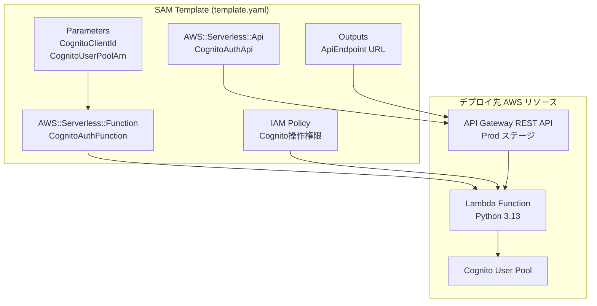
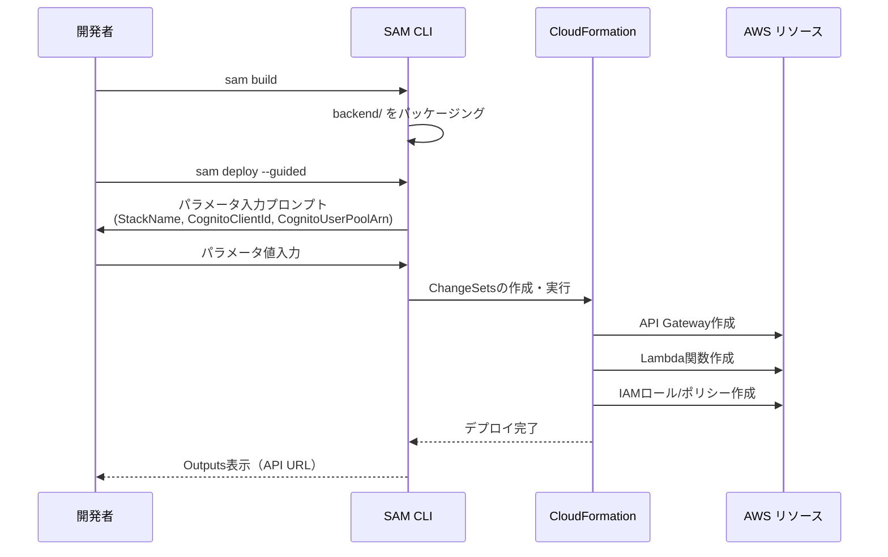

# 設計ドキュメント: SAMデプロイメント

## Overview

本設計は、既存のCognito認証SPAバックエンド（Lambda関数 + API Gateway REST API）をAWS SAM（Serverless Application Model）を使用してデプロイ可能にするためのインフラストラクチャ・アズ・コード（IaC）構成を定義する。

プロジェクトルートに`template.yaml`を作成し、以下のリソースを宣言的に定義する：
- API Gateway REST API（CORS設定付き）
- Lambda関数（Python 3.13ランタイム）
- IAMポリシー（Cognito操作の最小権限）
- パラメータ（CognitoClientId, CognitoUserPoolArn）
- 出力（APIエンドポイントURL）

デプロイは`sam build` → `sam deploy --guided`の標準ワークフローで実行する。

## Architecture



### デプロイフロー



## Components and Interfaces

### SAMテンプレート構成

| セクション | 内容 |
|-----------|------|
| `AWSTemplateFormatVersion` | `"2010-09-09"` |
| `Transform` | `AWS::Serverless-2016-10-31` |
| `Description` | スタックの説明（英語） |
| `Parameters` | CognitoClientId, CognitoUserPoolArn |
| `Resources` | API Gateway, Lambda関数 |
| `Outputs` | APIエンドポイントURL |

### リソース定義

| 論理ID | タイプ | 役割 |
|--------|--------|------|
| `CognitoAuthApi` | `AWS::Serverless::Api` | REST API（CORS付き） |
| `CognitoAuthFunction` | `AWS::Serverless::Function` | 認証処理Lambda |

### パラメータ定義

| パラメータ名 | 型 | 用途 |
|-------------|-----|------|
| `CognitoClientId` | String | Lambda環境変数 `COGNITO_CLIENT_ID` に設定 |
| `CognitoUserPoolArn` | String | IAMポリシーのリソース制約に使用 |

## Data Models

### template.yaml 完全定義

以下がプロジェクトルートに配置する`template.yaml`の完全な内容である：

```yaml
AWSTemplateFormatVersion: "2010-09-09"
Transform: AWS::Serverless-2016-10-31
Description: >
  Cognito authentication SPA backend - Lambda function with API Gateway REST API
  for user sign-in, sign-up, verification, password change, and code resend operations.

Parameters:
  CognitoClientId:
    Type: String
    Description: The Cognito User Pool App Client ID used for authentication operations
  CognitoUserPoolArn:
    Type: String
    Description: The ARN of the Cognito User Pool for IAM policy resource restriction

Resources:
  # API Gateway REST API with CORS configuration
  CognitoAuthApi:
    Type: AWS::Serverless::Api
    Properties:
      Name: !Sub "${AWS::StackName}-CognitoAuthApi"
      StageName: Prod
      Cors:
        AllowOrigin: "'*'"
        AllowMethods: "'GET,POST,OPTIONS'"
        AllowHeaders: "'Content-Type,Authorization'"

  # Lambda function for Cognito authentication operations
  CognitoAuthFunction:
    Type: AWS::Serverless::Function
    Properties:
      FunctionName: !Sub "${AWS::StackName}-CognitoAuthFunction"
      Handler: lambda_function.lambda_handler
      Runtime: python3.13
      CodeUri: backend/
      Timeout: 30
      Environment:
        Variables:
          COGNITO_CLIENT_ID: !Ref CognitoClientId
      Policies:
        - Statement:
            - Effect: Allow
              Action:
                - cognito-idp:InitiateAuth
                - cognito-idp:SignUp
                - cognito-idp:ConfirmSignUp
                - cognito-idp:ChangePassword
                - cognito-idp:ResendConfirmationCode
              Resource: !Ref CognitoUserPoolArn
      Events:
        SignIn:
          Type: Api
          Properties:
            Path: /signin
            Method: POST
            RestApiId: !Ref CognitoAuthApi
        SignUp:
          Type: Api
          Properties:
            Path: /signup
            Method: POST
            RestApiId: !Ref CognitoAuthApi
        Verify:
          Type: Api
          Properties:
            Path: /verify
            Method: POST
            RestApiId: !Ref CognitoAuthApi
        ChangePassword:
          Type: Api
          Properties:
            Path: /change-password
            Method: POST
            RestApiId: !Ref CognitoAuthApi
        ResendCode:
          Type: Api
          Properties:
            Path: /resend-code
            Method: POST
            RestApiId: !Ref CognitoAuthApi

Outputs:
  ApiEndpoint:
    Description: API Gateway endpoint URL for the Prod stage
    Value: !Sub "https://${CognitoAuthApi}.execute-api.${AWS::Region}.amazonaws.com/Prod"
```

### 設計判断の根拠

| 判断項目 | 選択 | 理由 |
|---------|------|------|
| API リソースの明示定義 | `AWS::Serverless::Api` を使用 | CORS設定とリソース命名の制御のため。暗黙のAPIでは名前のカスタマイズ不可 |
| CognitoUserPoolArn パラメータ | IAMポリシーのResource制約に使用 | 最小権限の原則。ワイルドカード `*` を避け特定User Poolに制限 |
| Policies の記法 | インラインStatement形式 | SAMの`CognitoPolicy`等の定義済みポリシーではリソース制約が不十分なため |
| FunctionName/Name の明示指定 | `!Sub` でスタック名接頭辞 | 同一アカウントでの複数スタックデプロイ時の名前衝突防止 |
| StageName | `Prod` 固定 | 単一ステージ構成でシンプルに保つ。複数環境はスタック分離で対応 |
| Timeout | 30秒 | Cognito API呼び出しのレイテンシを考慮した十分なタイムアウト |

## Error Handling

### デプロイ時のエラーハンドリング

| エラー状況 | 対応 |
|-----------|------|
| `sam build` 失敗 | Python依存関係の問題。`requirements.txt` の確認（現状は boto3 のみで Lambda ランタイムに含まれる） |
| パラメータ未指定 | `sam deploy --guided` で対話的に入力を促す |
| IAM権限不足 | デプロイ実行者に CloudFormation, Lambda, API Gateway, IAM の操作権限が必要 |
| スタック名重複 | 既存スタック名と衝突時は CloudFormation がエラーを返す。別名を指定する |
| CognitoUserPoolArn 不正 | IAMポリシー作成時に CloudFormation がバリデーションエラーを返す |

### ランタイムエラーハンドリング

Lambda関数自体のエラーハンドリングは既存の `lambda_function.py` に実装済み。SAMテンプレートによるインフラ変更はランタイム動作に影響しない。

## Testing Strategy

### テスト方針

本機能はInfrastructure as Code（IaC）であるため、プロパティベーステストは適用しない。宣言的なテンプレート定義に対しては、以下のテスト戦略を採用する。

### テスト種別

| テスト種別 | 対象 | 手法 |
|-----------|------|------|
| テンプレート検証 | template.yaml の構文 | `sam validate` コマンド |
| ビルド検証 | パッケージング成功 | `sam build` コマンド |
| 統合テスト | デプロイ後のAPI動作 | `sam deploy` 後に各エンドポイントをcurlで確認 |
| 既存ユニットテスト | Lambda関数ロジック | pytest（既存テスト `tests/backend/` で継続） |

### 検証手順

1. **テンプレート構文検証**:
   ```powershell
   sam validate --template template.yaml
   ```

2. **ビルド検証**:
   ```powershell
   sam build
   ```

3. **デプロイ検証**（手動）:
   ```powershell
   sam deploy --guided
   ```
   - パラメータ入力: StackName, CognitoClientId, CognitoUserPoolArn
   - デプロイ完了後、Outputs の ApiEndpoint URL を確認

4. **エンドポイント疎通確認**:
   ```powershell
   # サインアップテスト
   curl -X POST https://<api-id>.execute-api.ap-northeast-1.amazonaws.com/Prod/signup `
     -H "Content-Type: application/json" `
     -d '{"email":"test@example.com","password":"Test1234!"}'
   ```

### PBT非適用の理由

本機能はSAMテンプレート（YAML宣言ファイル）の作成であり：
- 入力/出力のある関数ではない
- 動作は入力によって変化しない（宣言的定義）
- 100回実行しても1回実行と同じ結果

代わりに `sam validate` による構文チェックと、デプロイ後の統合テストで品質を担保する。
